AWS API Gateway와 Lambda를 이용한 REST API 생성
========

## 1. API 생성

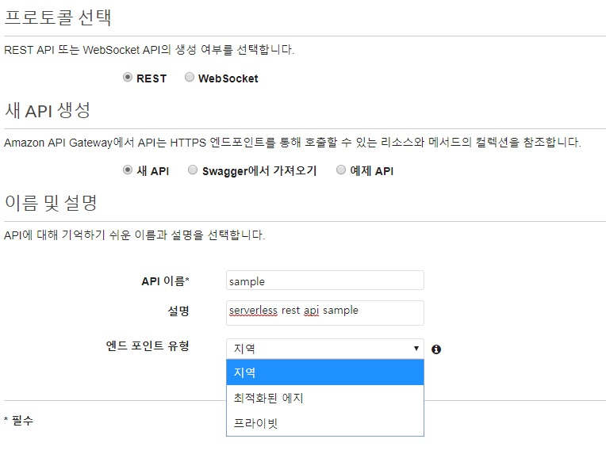

- AWS API Gateway에서 Lambda Function과 연결할 API를 생성
- 엔드 포인트 유형
  - 지역: 현재 리전에 배포
  - 최적화된 에지: CloudFront 네트워크에 배포
  - 프라이빗: VPC에서만 접근 가능. API Gateway용 VPC 엔드포인트를 통해서만 액세스가 가능해짐

## 2. Lambda 함수 생성

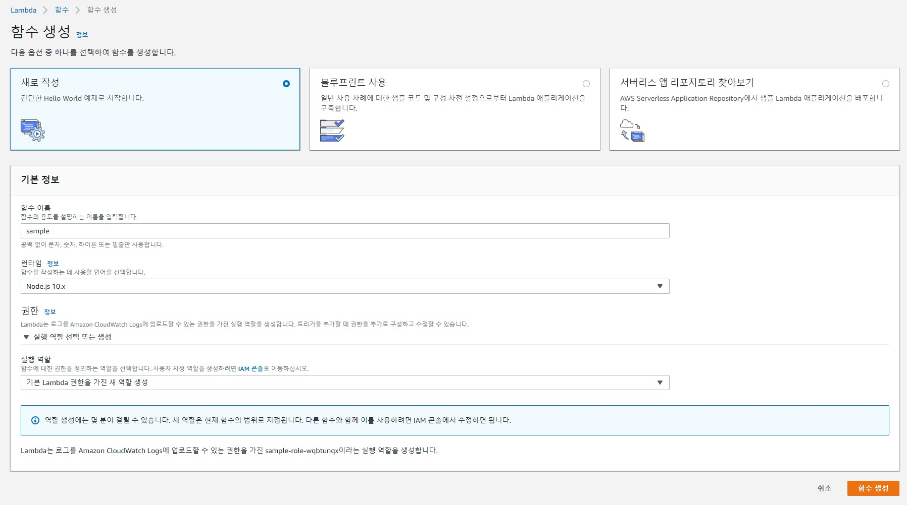

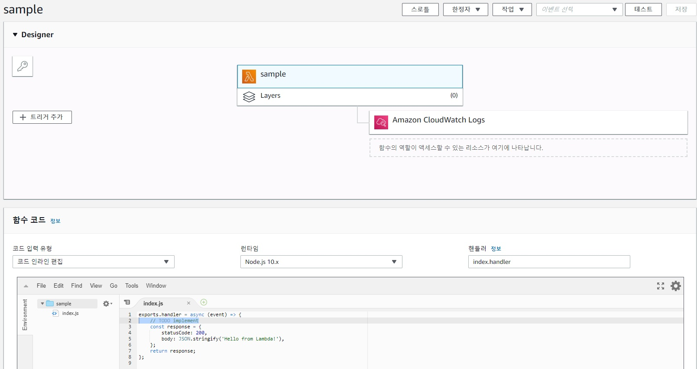

```js
// 예시 함수
exports.handler = async (event) => {
  const { name = 'anonymous', age = 20 } = event['body-json'];
  const response = {
    name,
    age
  }
  return response;
}
```
- API Gateway와 연결할 함수 생성
- 페이지상의 편집기에서 Lambda 함수를 작성하거나, 미리 작성한 함수 디렉토리를 압축한 zip파일을 업로드하여 함수를 등록
- event 객체에 API Gateway에서 넘겨주는 header, body, params, querystring 등의 값이 매핑되어 있음


## 2. 리소스 및 메소드 생성

### 2-1. 리소스 생성

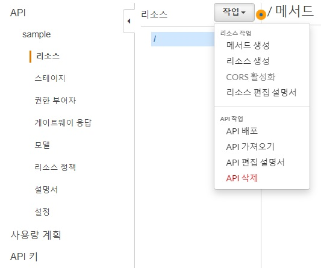


- REST API의 리소스와 경로를 생성
- 별도의 리소스를 사용하지 않고 루트 경로를 이용할 것이라면 리소스를 따로 만들지 않아도 된다

### 2-2. 메소드 생성

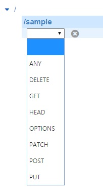

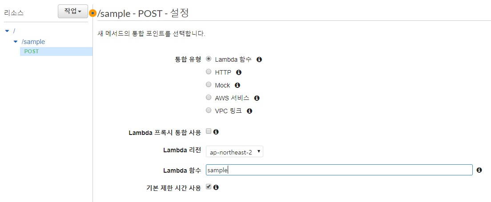

- REST API 리소스에 대한 메소드를 생성하고 Lambda 함수와 연결


## 3. 메소드 설정

### 3-1. 인증 관련 설정

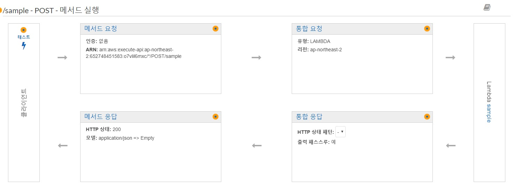

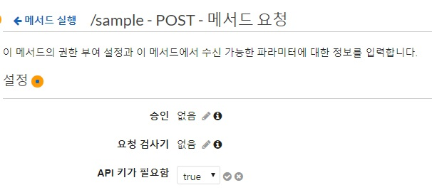

- 메소드 요청에서 해당 API와 관련된 인증 설정
  - [API Gateway의 REST API에 대한 액세스 제어 및 관리](https://docs.aws.amazon.com/ko_kr/apigateway/latest/developerguide/apigateway-control-access-to-api.html)
- HTTP API 형태로 이용할 것이므로 API 키 요구를 활성화

### 3-2. 요청 매핑 템플릿 설정

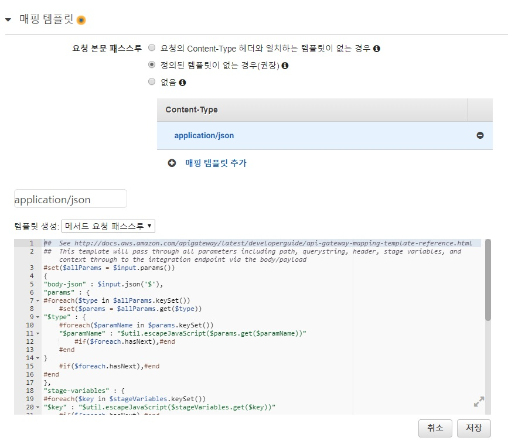

- 통합 요청에서 매핑 템플릿을 추가
- 메서드 요청 패스스루 템플릿을 이용. 필요 시 별도의 템플릿을 생성하여 이용할 수 있다
  - [API Gateway 모델 및 매핑 템플릿](https://docs.aws.amazon.com/ko_kr/apigateway/latest/developerguide/example-photos.html)
  - [API Gateway 매핑 템플릿과 액세스 로깅 변수 참조](https://docs.aws.amazon.com/ko_kr/apigateway/latest/developerguide/api-gateway-mapping-template-reference.html)


#### 매핑 결과

```js
"body-json" : {"name":"hachicore","age":17},
"params" : {
  "path" : {},
  "querystring" : {},
  "header" : {}
},
```

## 4. 테스트

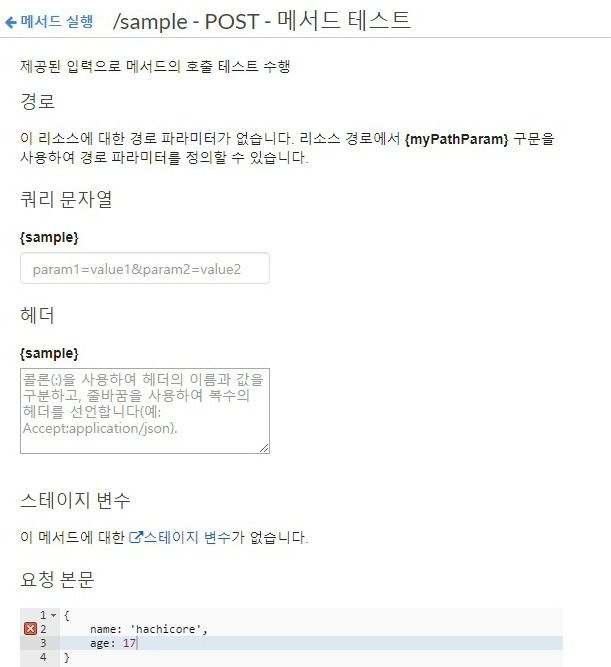

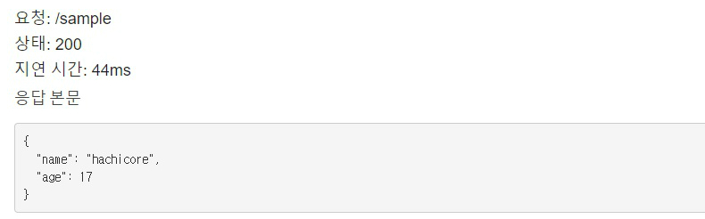

- 배포 전 API에 대한 테스트 수행 가능


## 5. API 배포

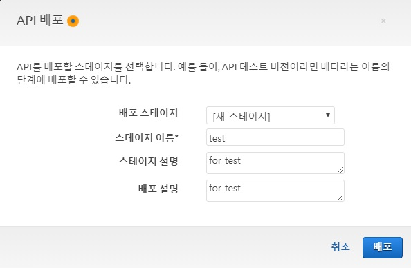

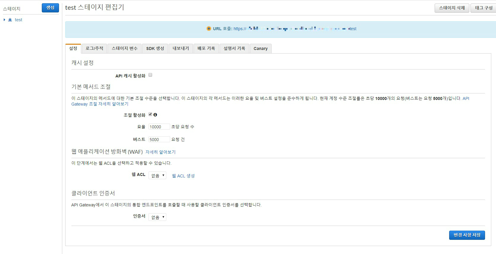

- 외부에서 API를 사용할 수 있도록 스테이지를 생성하고 API를 배포
- 상단에 표기된 API 엔드포인트를 통해 외부에서 API를 호출할 수 있다


## 6. API Key 생성

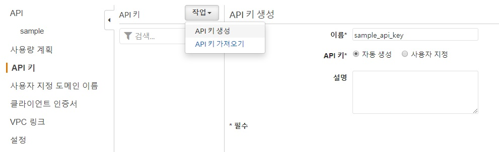

- API 인증에 사용할 키를 생성
- 사용량 계획을 생성하면서 생성 가능


## 7. 사용량 계획 생성

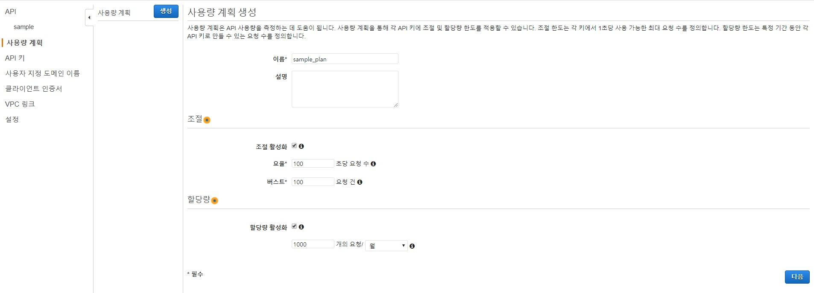

- 요율: API Gateway가 429 Too Many Requests 응답을 반환하지 않고 일정한 상태로 제공할 수 있는 초당 최대 단계 수준 요청 횟수
- 버스트: API Gateway가 429 Too Many Requests 응답을 반환하지 않고 동시에 제공할 수 있는 최대 단계 수준 요청 횟수

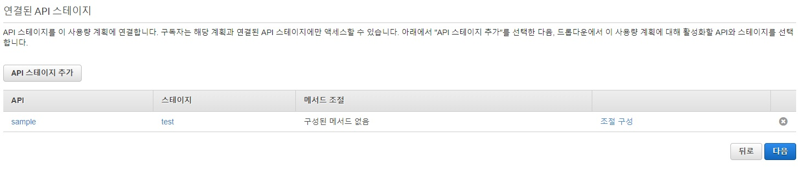

- 사용량 계획과 연결할 API 스테이지를 선택
- 메소드별로 세부적인 사용량 조절이 가능

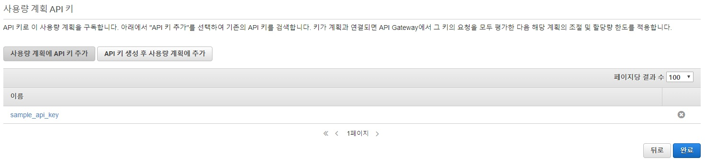

- 사용할 API Key를 추가


## 8. 결과


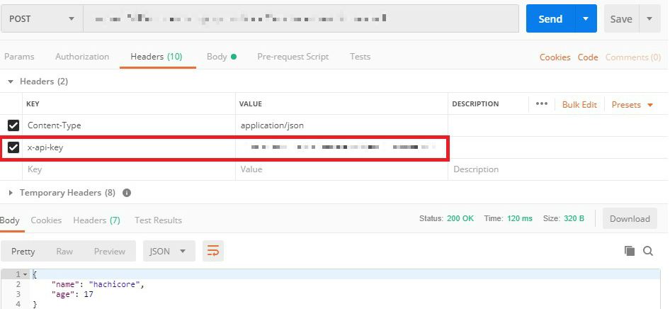

- API Key 이용 시 `x-api-key` 값을 헤더에 포함시켜 전송해야 제대로 된 결과를 받을 수 있음
