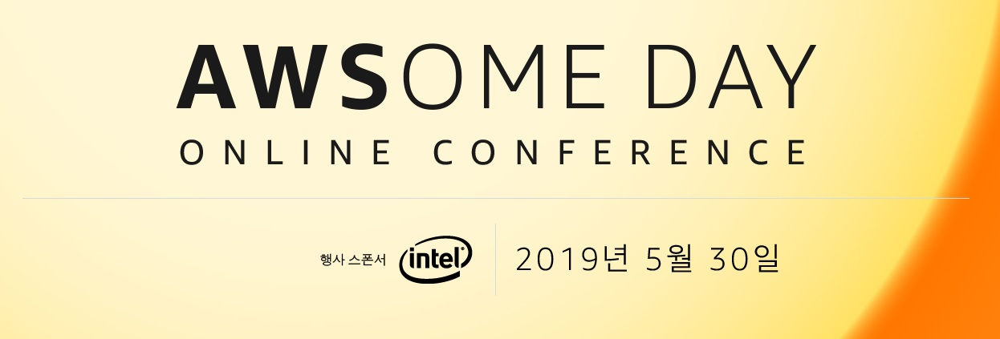

2019 AWSOME DAY 온라인 컨퍼런스 후기
========

## 참가 이유

현재 재직중인 회사가 전통적인 온프레미스 환경인지라(사무실 이전 때 서버 설치부터 네트워크 설치까지 직접 했음 ㅡㅡ;;) 개인적으로 AWS를 학습하고 있었는데 마침 컨퍼런스가 있다는 소식을 듣고서 신청했다. 업무와 관련이 없다는 이유로 휴가를 써야했지만 

## 강의 과정

1. **[AWS 클라우드 개념](https://www.slideshare.net/awskorea/1-aws-awsome-day-online-conference-146872017/)**: 클라우드의 가치와 AWS 클라우드 적용 시 얻을 수 있는 혜택에 대해 알아봅니다.
2. **[AWS 핵심 서비스](https://www.slideshare.net/awskorea/2-aws-awsome-day-online-conference/)**: 다양한 AWS 카테고리와 서비스에 대한 설명과 함께, 각 서비스의 역할과 언제, 어떻게 활용할 수 있는지 알아봅니다.
3. **[AWS 보안](https://www.slideshare.net/awskorea/3-aws-awsome-day-online-conference/)**: AWS가 클라우드 보안을 어떻게 다루는지, AWS 공동 책임 모델, AWS 액세스 제어 및 관리, AWS 보안 규정 준수 프로그램, AWS 보안 리소스에 대해 알아봅니다.
4. **[AWS 아키텍쳐 설계](https://www.slideshare.net/awskorea/4-aws-awsome-day-online-conference/)**: Well-Architected 프레임워크와 내결함성 및 고가용성, 그리고 웹호스팅을 위한 참조 아키텍처를 포함한AWS 아키텍처에 대해 알아봅니다. 
5. **[AWS 요금 및 지원](https://www.slideshare.net/awskorea/5-aws-awsome-day-online-conference/)**: AWS 핵심 서비스의 요금을 결정하는 기본 정보에 대해 살펴보고, 총 소유 비용 계산기와  AWS 지원 플랜에 대해 알아봅니다.

## 느낀 점

- [AWS Cloud Practitioner Essentials](https://www.aws.training/transcript/curriculumplayer?transcriptId=0-IIB4GRHkCPNvcaxScRpg2) 과정의 한글 패치 버전
- 몇몇 서비스에 대한 내용이 생략된 점을 제외하면 구성이나 내용 면에서 큰 차이점이 없기에 심오한 내용을 기대했다면 다소 실망했을지도 모르겠다
- 클라우드 입문자나 클라우드 환경 도입을 고려중인 사람에게는 적절한 강의였다고 생각한다
- 100분 가량을 쉬지 않고 진행한 AWS 핵심 서비스 파트는 두 번 나누어서 진행했더라면 하는 아쉬움이 있다. 라이브 방송도 아니었는데
- 얼마 전에 해당 AWS 교육 과정을 봤었기 때문에 휴가를 쓴게 아깝긴 했다. 강의 소개를 제대로 안 본 내 탓이긴 하지만...
