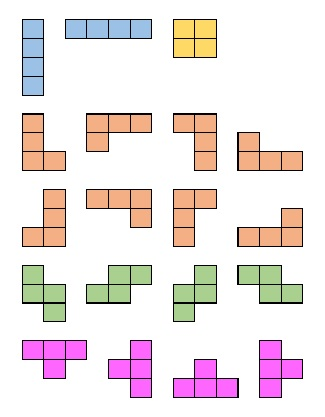

# 백준 알고리즘 14500번 - 테트로미노

- [https://www.acmicpc.net/problem/14500](https://www.acmicpc.net/problem/14500)
-   사용 언어: Java

## 문제

폴리오미노란 크기가 1×1인 정사각형을 여러 개 이어서 붙인 도형이며, 다음과 같은 조건을 만족해야 한다.

- 정사각형은 서로 겹치면 안된다.
- 도형은 모두 연결되어 있어야 한다.
- 정사각형의 꼭짓점끼리 연결되어 있어야 한다. 즉, 변과 꼭짓점이 맞닿아있으면 안된다.


정사각형 4개를 이어 붙인 폴리오미노는 테트로미노라고 하며, 다음과 같은 5가지가 있다.

아름이는 크기가 N×M인 종이 위에 테트로미노 하나를 놓으려고 한다. 종이는 1×1 크기의 칸으로 나누어져 있으며, 각각의 칸에는 정수가 하나 쓰여 있다.

테트로미노 하나를 적절히 놓아서 테트로미노가 놓인 칸에 쓰여 있는 수들의 합을 최대로 하는 프로그램을 작성하시오.

테트로미노는 반드시 한 정사각형이 정확히 하나의 칸을 포함하도록 놓아야 하며, 회전이나 대칭을 시켜도 된다.

## 입력

첫째 줄에 종이의 세로 크기 N과 가로 크기 M이 주어진다. (4 ≤ N, M ≤ 500)

둘째 줄부터 N개의 줄에 종이에 쓰여 있는 수가 주어진다. i번째 줄의 j번째 수는 위에서부터 i번째 칸, 왼쪽에서부터 j번째 칸에 쓰여 있는 수이다. 입력으로 주어지는 수는 1,000을 넘지 않는 자연수이다.

## 출력
 
첫째 줄에 테트로미노가 놓인 칸에 쓰인 수들의 합의 최댓값을 출력한다.

## 풀이 

```java
import java.util.Scanner;

// https://www.acmicpc.net/problem/14500
public class BOJ14500 {

	// 0,0 을 기준으로
	private static int[][][] tetro = {
		{ {0, 1}, {0, 2}, {0, 3} },
		{ {1, 0}, {2, 0}, {3, 0} },
		{ {0, 1}, {1, 0}, {1, 1} },
		{ {1, 0}, {2, 0}, {2, 1} },
		{ {1, 0}, {0, 1}, {0, 2} },
		{ {0, 1}, {1, 1}, {2, 1} },
		{ {1, 0}, {1, 1}, {1, 2} },
		{ {0, 1}, {-1, 1}, {-2, 1} },
		{ {0, 1}, {0, 2}, {1, 2} },
		{ {1, 0}, {2, 0}, {0, 1} },
		{ {0, 1}, {0, 2}, {-1, 2} },
		{ {1, 0}, {1, 1}, {2, 1} },
		{ {0, 1}, {-1, 1}, {-1, 2} },
		{ {1, 0}, {0, 1}, {-1, 1} },
		{ {0, 1}, {1, 1}, {1, 2} },
		{ {0, 1}, {1, 1}, {0, 2} },
		{ {-1, 1}, {0, 1}, {1, 1} },
		{ {0, 1}, {-1, 1}, {0, 2} },
		{ {1, 0}, {1, 1}, {2, 0} }	
	};
	
	public static void main(String[] args) {
		Scanner sc = new Scanner(System.in);
		int n = sc.nextInt();
		int m = sc.nextInt();

		// [세로][가로]
		int[][] d = new int[n][m];
		for (int i = 0; i < n; i++) {
			for (int j = 0; j < m; j++) {
				d[i][j] = sc.nextInt();
			}
		}
	
		int sum = 0;
		for(int y = 0; y < n; y++) {
			for(int x = 0; x < m; x++) {
				for(int i = 0; i < 19; i++) {
					// 기준점. 기준점은 배열을 벗어날 일이 없다
					int temp = d[y][x];
					// 기준점을 제외한 나머지 3곳
					for(int k = 0; k < 3; k++) {
						int ny = y + tetro[i][k][0];
						int nx = x + tetro[i][k][1];
						// 배열을 벗어나는지 체크
						if(ny < 0 || ny > n-1 || nx < 0 || nx > m-1) break;
						temp += d[ny][nx];
					}
					if(sum < temp) sum = temp;
				}
			}
		}
		System.out.println(sum);
	}
}
```

## 풀이시 유의사항


- 5개의 테트로미노를 회전 또는 대칭시켰을 경우 나오는 모양의 수는 위의 이미지와 같이 총 19가지
- 테트로미노의 네 칸중 **기준점**을 하나 잡아 놓을 수 있는 위치를 계산 -> 놓을 수 있는 방법은 NM 보다는 작거나 같으므로 브루트 포스로 풀이 가능
- 2차원 배열 생성 및 값 입력 시 가로, 세로 구별을 제대로 할 것. (`[세로][가로]`)
- 시간 복잡도는 O(nm)
