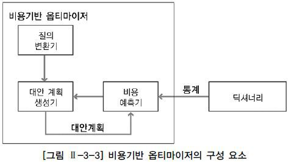
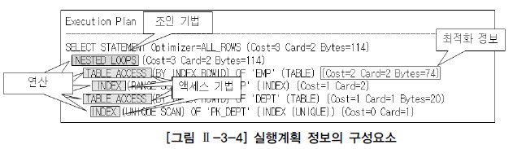
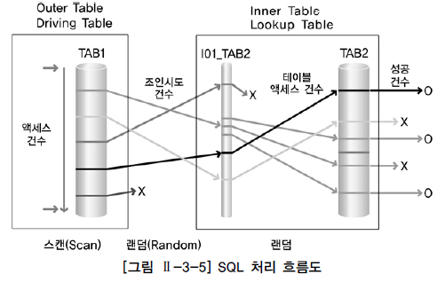

옵티마이저와 실행계획
========

## 1. 옵티마이저

- 사용자가 질의한 SQL문에 대해 최적의 실행 방법을 결정하는 역할을 수행
- 최적의 실행 방법을 실행 계획(Execution Plan) 이라고 한다
- 규칙 기반 옵티마이저 / 비용 기반 옵티마이저로 구분
- 대부분의 RDB는 비용 기반 옵티마이저만을 제공한다

### 가. 규칙 기반 옵티마이저

- 규칙(우선 순위)를 가지고 실행계획을 생성
- 인덱스 유무와 종류, 연산자의 종류, SQL문에서 참조하는 객체의 종류 등을 이용
- 규칙 기반 옵티마이저는 우선 순위가 높은 규칙이 적은 일량으로 해당 작업을 수행하는 방법이라고 판단

### 나. 비용 기반 옵티마이저

- SQL문을 처리하는데 필요한 비용이 가장 적은 실행계획을 선택하는 방식
- 비용: SQL문을 처리하기 위해 예상되는 소요시간 또는 자원 사용량
- 테이블, 인덱스, 컬럼 등의 다양한 **객체 통계정보**와 **시스템 통계정보** 등을 이용
- 통계정보가 없는 경우 비용기반 옵티마이저는 정확한 비용 예측이 불가능해져서 비효율적인 실행계획을 생성할 수 있음
- 정확한 통계정보를 유지하는 것은 비용기반 최적화에서 중요한 요소

#### 비용 기반 옵티마이저 구성요소

1. 질의 변환기: 사용자가 작성한 SQL문을 처리하기에 보다 용이한 형태로 변환하는 모듈
2. 대안 계획 생성기: 동일한 결과를 생성하는 다양한 대안 계획을 생성하는 모듈. 연산의 적용 순서 변경, 연산 방법 변경, 조인 순서 변경 등을 통해 생성
3. 비용 예측기: 대안 계획 생성기에 의해서 생성된 대안 계획의 비용을 예측하는 모듈. 연산의 중간 집합의 크기 및 결과 집합의 크기, 분포도 등의 예측이 정확해야 한다

## 2. 실행 계획

- SQL에서 요구한 사항을 처리하기 위한 절차와 방법
- SQL을 어떤 순서로 실행할 지를 결정하는 작업
- 실행계획을 구성하는 요소에는 조인 순서, 조인 기법, 액세스 기법, 최적화 정보 등이 있음

### 실행계획 정보의 구성요소

#### 1) 조인 순서
- 조인작업을 수행할 때 참조하는 테이블의 순서

#### 2) 조인 기법
- 두 개의 테이블을 조인할 때 사용할 수 있는 방법
- NL Join, Hash Join, Sort Merge Join 등이 있음

#### 3) 엑세스 기법
- 하나의 테이블을 액세스할 때 사용할 수 있는 방법
- 인덱스 스캔: 인덱스를 이용하여 테이블을 액세스
- 전체 테이블 스캔: 테이블 전체를 모두 읽으면서 조건을 만족하는 행을 탐색

#### 4) 최적화 정보
- 옵티마이저가 실행계획의 각 단계마다 예상되는 비용 사항을 표시한 것.  
- 실행계획에 비용 사항이 표시된다는 것은 비용기반 최적화 방식으로 실행계획을 생성하였다는 것을 의미.
- 실제 실행 결과가 아닌, 통계 정보를 바탕으로 옵티마이저가 계산한 예상치
- Cost: 상대적인 비용 보고
- Card: Cardinality의 약자. 주어진 조건을 만족한 결과 집합 혹은 조인 조건을 만족한 결과 집합의 건수
- Bytes: 결과 집합이 차지하는 메모리 양을 바이트로 표시한 것

#### 5) 연산
- 여러 가지 조작을 통해서 원하는 결과를 얻어내는 일련의 작업
- 조인 기법, 엑세스 기법, 필터, 정렬, 집계, 뷰 등 다양한 종류가 존재

### 3. SQL 처리 흐름도

- SQL의 내부적인 처리 절차를 시각적으로 표현한 도표
- 실행계획을 시각화 한 것
- 성능적인 관점을 살펴보기 위해서 SQL 처리 흐름도에 일량을 함께 표시할 수 있음