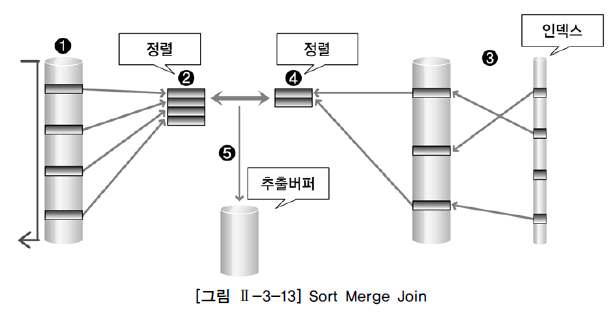

조인 수행원리
========

## 1. Nested-Loop Join

- 프로그래밍에서 사용하는 중첩된 반복문과 유사한 방식으로 조인을 수행
  - `FOR 선행 테이블 읽음 → 외부 테이블(Outer Table) FOR 후행 테이블 읽음 → 내부 테이블(Inner Table) (선행 테이블과 후행 테이블 조인)`
- 반복문의 외부에 있는 테이블을 선행 테이블, 드라이빙 테이블, 외부 테이블 등으로 부름
- 반복문의 내부에 있는 테이블을 후행 테이블, 드라이븐 테이블, 내부 테이블 등으로 부름
- 선행 테이블의 조건을 만족하는 행을 추출하여 후행 테이블을 읽으면서 조인을 수행
- 결과 행의 수가 적은 테이블을 조인 순서상 선행 테이블로 선택하는 것이 전체 일량을 줄일 수 있음
- NL Join은 랜덤 방식으로 데이터를 액세스하기 때문에 처리 범위가 좁은 것이 유리
- 선행 테이블에 사용 가능한 인덱스가 존재한다면 인덱스를 통해 선행 테이블을 액세스할 수 있음
- NL Join 기법은 조인이 성공하면 바로 조인 결과를 사용자에게 보여줄 수 있음

### 동작

1. 선행 테이블에서 주어진 조건을 만족하는 첫번째 행을 찾음 -> 이때 선행 테이블에 주어진 조건을 만족하지 않는 경우 해당 데이터는 필터링 됨
2. 선행 테이블의 조인 키 값을 가지고 후행 테이블에 조인 키가 존재하는지 탐색 -> 조인 시도
3. 후행 테이블의 인덱스에 선행 테이블의 조인 키가 존재하는지 확인 -> 선행 테이블의 조인 값이 후행 테이블에 존재하지 않으면 선행 테이블 데이터는 필터링 됨(더 이상 조인 작업을 진행할 필요가 없음)
4. 인덱스에서 추출한 레코드 식별자를 이용하여 후행 테이블을 액세스 -> 인덱스 스캔을 통한 테이블 액세스 후행 테이블에 주어진 조건까지 모두 만족하면 해당 행을 추출버퍼에 넣음
5. 해당 작업을 반복 수행함

## 2. Sort Merge Join

- 조인 컬럼을 기준으로 데이터를 정렬하여 조인을 수행
- 주로 스캔 방식으로 데이터를 읽음
- 넓은 범위의 데이터를 처리할 때 이용되던 조인 기법
- 정렬할 데이터가 많아 메모리에서 모든 정렬 작업을 수행하기 어려운 경우에는 임시 영역(디스크)을 사용하기 때문에 성능이 떨어질 수 있음
  - 대량의 조인 작업에서 정렬 작업을 필요로 하는 Sort Merge Join 보다는 CPU 작업 위주로 처리하는 Hash Join이 성능상 유리
- 동등 조인만 가능한 Hash Join과 달리 동등 조인, 비동등 조인에 대해서도 조인 작업이 가능함
- 조인 컬럼의 인덱스를 사용하지 않기 때문에 조인 컬럼의 인덱스가 존재하지 않을 경우에도 사용할 수 있는 조인 기법
- 조인할 테이블 중에서 이미 앞 단계의 작업을 수행하는 도중에 정렬 작업이 미리 수행되었다면 조인을 위한 정렬 작업은 발생하지 않을 수 있음

### 동작

1. 선행 테이블에서 주어진 조건을 만족하는 행을 찾음
2. 선행 테이블의 조인 키를 기준으로 정렬 작업을 수행. 1~2번 작업을 선행 테이블의 조건을 만족하는 모든 행에 대해 반복 수행
3. 후행 테이블에서 주어진 조건을 만족하는 행을 찾음
4. 후행 테이블의 조인 키를 기준으로 정렬 작업을 수행. 3~4번 작업을 후행 테이블의 조건을 만족하는 모든 행에 대해 반복 수행
5. 정렬된 결과를 이용하여 조인을 수행하며 조인에 성공하면 추출버퍼에 넣음

## 3. Hash Join

- NL Join의 랜덤 액세스 문제, Sort Merge Join의 정렬 작업의 부담을 해결하기 위한 대안으로 등장
- 해싱 기법을 이용하여 조인을 수행
- 조인을 수행할 테이블의 조인 칼럼을 기준으로 해시 함수를 수행하여 서로 동일한 해시 값을 갖는 것들 사이에서 실제 값이 같은지를 비교하면 조인을 수행
  - 선행 테이블을 이용하여 먼저 해시 테이블을 생성한다고 해서 선행 테이블을 Build Input이라고도 한다
  - 후행 테이블은 만들어진 해시 테이블에 대해 해시 값의 존재 여부를 검사한다고 해서 Prove Input이라고도 한다
- **조인 컬럼의 인덱스를 사용하지 않기 때문에 조인 컬럼의 인덱스가 존재하지 않을 경우에도 사용 가능**
- **해시 함수를 이용하여 조인을 수행하기 때문에 동등 조인에서만 사용 가능**
  - 해시 함수가 적용될 때 동일한 값은 항상 같은 값으로 해싱됨이 보장됨
  - 해시 함수 적용 시 보다 큰 값이 항상 큰 값으로 해싱되거나 작은 값이 항상 작은 값으로 해싱된다는 보장이 없으므로
- Hash Join은 조인 작업을 수행하기 위해 해시 테이블을 메모리에 생성하는데, 메모리 크기가 부족하다면 임시 영역(디스크)에 저장
  - 이 경우 추가 작업이 필요해지기 때문에 결과 행의 수가 적은 테이블을 선행 테이블로 사용하는 것이 좋음

### 동작

1. 선행 테이블에서 주어진 조건을 만족하는 행을 찾음
2. 선행 테이블의 조인 키를 기준으로 해시 함수를 적용하여 해시 테이블을 생성 -> 조인 컬럼과 SELECT 절에서 필요로 하는 컬럼도 함께 저장. 1~2번 작업을 선행 테이블의 조건을 만족하는 모든 행에 대해 반복 수행
3. 후행 테이블에서 주어진 조건을 만족하는 행을 찾음
4. 후행 테이블의 조인 키를 기준으로 해시 함수를 적용하여 해당 버킷을 찾음 -> 조인 키를 이용해서 실제 조인될 데이터를 찾음
5. 조인에 성공하면 추출버퍼에 넣음. 3~5번 작업을 후행 테이블의 조건을 만족하는 모든 행에 대해서 반복 수행
