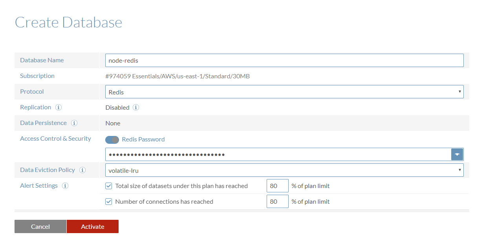
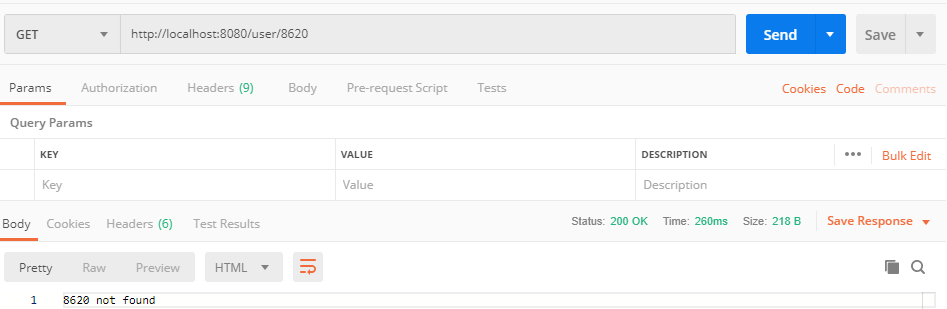

Node-Redis 연동 예시
========

## 1. 개요

노드 프로그램은 하나의 프로세스로 작동하기 때문에 PM2 등을 이용하여 멀티 프로세스 환경으로 동작하는 경우, 각 프로세스간의 자원을 공유하기 위해 레디스나 멤캐시드와 같은 인메모리 데이터베이스를 이용하게 된다

그중 레디스는 기본적으로 Key-Value 저장 방식이지만 문자열, 리스트, 해시, 셋, 정렬된 셋, 스트림과 같은 다양한 데이터형을 지원하기 때문에 멤캐시드 대비 다양한 기능을 구현할 수 있다는 장점이 있다.

## 2. 설치

### Redis

예시에서는 Redis를 직접 설치하지 않고 [redislabs](https://redislabs.com) 에서 제공하는 클라우드 환경을 이용한다


회원 가입 후 subscription 생성. 30MB 플랜을 선택해야 과금되지 않음



DB 생성


생성된 DB의 엔드포인트로 DB에 접근 가능


### GUI 클라이언트

[P3X Redis UI](https://electronjs.org/apps/p3x-redis-ui)를 이용


## 3. 설정

### cache/config.js

```js
const dotenv = require('dotenv');

dotenv.config();

module.exports = {
  development: {
    host: process.env.REDIS_CACHE_HOST,
    port: process.env.REDIS_CACHE_PORT,
    password: process.env.REDIS_CACHE_PW, 
  }
}
```
- `.env`에 등록된 Redis 서버 관련 정보를 불러오는 모듈


### cache/index.js
```js
const Redis = require('ioredis');

const env = process.env.NODE_ENV || 'development';
const config = require('./config')[env];

module.exports = new Redis(config);
```
- 캐시로 사용될 Redis 클라이언트를 생성하고 export 하는 모듈


### app.js
```js
const express = require('express');
const morgan = require('morgan');

const cache = require('./cache');
const userRouter = require('./routes/user');

const app = express();

app.use(morgan('dev'));
app.use(express.json());
app.use(express.urlencoded({ extended : false }));

app.use((req, res, next) => {
  req.cache = cache;
  next();
});

app.use('/user', userRouter);

app.listen(8080, () => {
  console.log('server is running on 8080');
});
```
- 테스트 결과 확인을 위한 express 서버
- 미들웨어로 Redis 클라이언트 객체를 req 객체에 등록


### routes/user.js
```js
const express = require('express');
const router = express.Router();

router.get('/:id', async (req, res, next) => {
  try {
    const { id } = req.params;
    const cachedUser = await req.cache.get(id);
    
    if (cachedUser) {
      console.log('Cache hit');
      return res.json(JSON.parse(cachedUser));
    } else {
      console.log('Cache miss');
      return res.send(`${id} not found`);
    }
  } catch (error) {
    console.error(error);
    return next(error);
  }
});

router.post('/', async (req, res, next) => {
  try {
    const key = req.body.id;
    const value = JSON.stringify(req.body);
    const result = await req.cache.set(key, value, 'EX', 30);
    return res.json(result);
  } catch (error) {
    console.error(error);
    return next(error);
  }
});

module.exports = router;
```
- 테스트를 위한 라우터 설정
- POST method로 전달된 데이터를 캐시에 저장
  - 프로젝트의 요구사항에 알맞은 레디스 자료형을 사용하여 캐싱
  - 예시에서는 redis의 set 명령어를 이용하여 string 타입으로 저장(Key-Value 1:1 관계)
  - set 명령어의 EX(EXPIRE) 옵션을 설정하여 key의 만료 시간을 동시에 설정 가능. 30초로 설정
- GET method로 캐시 유무 확인 후 결과 전달


## 4. 실행 결과


- 서버 기동 후 POST로 캐싱할 JSON 객체 전송


- 레디스 내 자료 저장 여부 확인
- EXPIRE 옵션으로 지정한 시간이 지난 뒤 이후 해당 자료는 삭제됨(TTL, Time To Live)


- get 요청으로 캐싱된 결과 확인



- 캐시 내 데이터가 존재하지 않는 경우


```bash
$ npm start
> node_redis@1.0.0 start D:\node_workspace\node_redis_practice
> nodemon app

[nodemon] 1.19.1
[nodemon] to restart at any time, enter `rs`
[nodemon] watching: *.*
[nodemon] starting `node app.js`
server is running on 8080
POST /user 200 253.377 ms - 4
Cache hit
GET /user/8620 200 230.538 ms - 32
Cache miss
GET /user/8620 200 253.528 ms - 14
```


## 5. 소스 코드

[github](https://github.com/8c6t/node_redis_practice)
