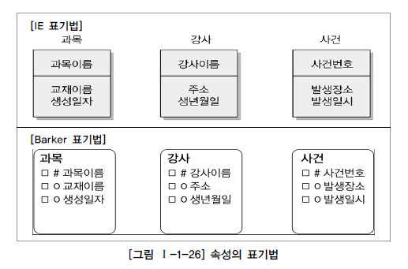

속성(Attribute)
========

## 1. 속성(Attribute)의 개념

업무에서 필요로 하는, 인스턴스로 관리하고자 하는 의미상 더 이상 분리되지 않는 최소의 데이터 단위

- 업무에서 필요로 한다
- 의미성 더 이상 분리되지 않는다
- **엔터티를 설명하고 인스턴스의 구성요소가 된다.**

## 2. 엔터티, 인스턴스와 속성, 속성값에 대한 내용과 표기법

### 가. 엔터티, 인스턴스, 속성, 속성값의 관계

|일반적 개념 |모델링|DB 객체|
|-|-|-|
|데이터 집합, 관계집합(Relationship set)|개체 집합(Entity Set)|테이블(Table)|
|관계집합 중 어떤 행(Row)|튜플(Tuple) 엔터티(Entity)|레코드(Record)|
|관계집합 중 어떤 열(Column)|속성(Attribute)|필드(Field)|

#### 1) 엔터티
- 엔터티 ≒ 테이블
- 엔터티는 인스턴스의 집합

#### 2) 인스턴스
- 인스턴스 ≒ 행(Row)
- 엔터티의 하나의 값
- 엔터티에는 두 개 이상의 인스턴스가 존재
- 과목(엔터티) : 수학, 영어, 국어(인스턴스)
- 사건(엔터티) : 사건번호 2010-001, 2010-002 등(인스턴스) 

#### 3) 속성(Attribute)
- 속성 ≒ 열(Column)
- 각각의 엔터티에는 고유의 성격을 표현하는 속성 정보를 두 개 이상 가짐
- 속성은 **엔터티에 속한 엔터티**에 대한 자세하고 구체적인 정보를 나타냄
- 학생(엔터티) : 학번, 이름, 이수학점(속성)

#### 4) 속성값(Value)
- 한 개의 속성은 한 개의 속성값을 가짐
- 홍길동, 서울시 강서구, 1967년 12월 31일과 같이 각각의 속성에 대한 구체적인 값

### 나. 속성의 표기법

## 3. 속성의 특징
- 엔터티와 마찬가지로 반드시 해당 업무에서 필요하고 관리하고자 하는 정보이어야 한다.
- 정규화 이론에 근간하여 정해진 주식별자에 함수적 종속성을 가져야 한다.
- **하나의 속성에는 한 개의 값만**을 가진다. 하나의 속성에 여러 개의 값이 있는 다중값일 경우 별도의 엔터티를 이용하여 분리한다.

## 4. 속성의 분류

### 가. 속성의 특성에 따른 분류
#### 1) 기본 속성
- 업무로부터 추출한 모든 속성
- 엔터티에 가장 일반적이고 많은 속성을 차지
- 엔터티를 식별하기 위해 부여된 일련번호, 그리고 다른 속성을 계산하거나 영향을 받아 생성된 속성을 제외한 모든 속성

#### 2) 설계 속성
- 데이터 모델링을 위해, 업무를 규칙화하기 위해 속성을 새로 만들거나 변형하여 정의하는 속성
- 코드성 속성은 원래 속성을 업무상 필요에 의해 변형하여 만든 설계속성
- 일련번호와 같은 속성은 단일한 식별자(Unique)를 부여하기 위해 모델 상애서 새로 정의하는 설계속성

#### 3) 파생 속성
- 다른 속성에 영향을 받아 발생하는 속성으로서 보통 **계산된 값**들
- **데이터 조회시 성능을 위해 미리 속성값을 계산한 것**
- 프로세스 설계 시 데이터 정합성을 유지하기 위해 유의해야 함
- 가급적 파생속성은 적게 정의하는 것이 좋다

### 나. 엔터티 구성방식에 따른 분류

- PK : 엔터티를 식별할 수 있는 속성
- FK : 다른 엔터티와의 관계에서 포함된 속성
- 일반 속성 : 엔터티에 포함되어 있고 PK, FK에 포함되지 않은 속성
- 단순 속성 : 더 이상 다른 속성들로 구성될 수 없는 단순한 속성
- 복합 속성 : 여러 세부 속성들로 구성된 속성(주소 속성 -> 시, 구, 동, 번지 등)
- 단일값 속성 : 속성 하나에 한 개의 값을 가지는 경우(주민등록번호 속성)
- 다중값 속성 : 여러 개의 값을 가질 수 있는 경우(전화번호 속성 -> 집, 휴대전화, 회사 전화번호)

> 다중값 속성의 경우 하나의 엔터티에 포함될 수 없으므로 1차 정규화를 하거나, 별도의 엔터티를 만들어 관계로 연결해야 한다

## 5. 도메인

- 각 속성의 가질 수 있는 범위
- 엔터티 내에서 속성에 대한 데이터 타입과 크기 그리고 제약사항을 지정하는 것

## 6. 속성의 명명

1. 해당 업무에서 사용하는 이름을 부여
2. 서술식 속성명은 사용하지 않음
3. 약어 사용은 가급적 제한
4. 전체 데이터 모델에서 **유일성**을 확보하는 것이 좋음(일관성 X)