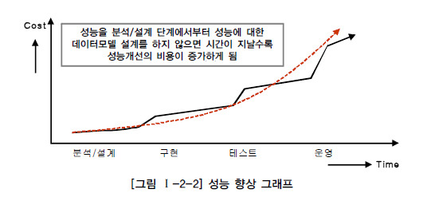

성능 데이터 모델링
========

## 1. 성능 데이터 모델링의 정의

성능 데이터 모델링이란 DB 성능 향상을 목적으로 설계단계의 데이터 모델링 때부터 성능과 관련된 사항이 데이터 모델링에 반영될 수 있도록 하는 것

### 성능이 저하되는 데이터 모델

1. 데이터 모델 구조에 의해 성능 저하
2. 데이터가 대용량이 됨으로 인해 불가피하게 성능 저하
3. 인덱스 특성을 충분히 고려하지 않고 인덱스를 생성하여 성능 저하

> 데이터 모델링을 할 때 어떤 작업 유형에 따라 성능 향상을 도모해야 하는지 목표를 분명하게 해야 정확한 성능 향성 모델링을 할 수 있다

## 2. 성능 데이터 모델링 수행시점

- 프로젝트 수행 중에 있어서 사전에 할 수록 비용이 들지 않는다
- 분석/설계 단계에서 데이터 모델에 성능을 고려한 데이터 모델링을 수행할 경우 성능저하에 따른 재업무 비용을 최소화 할 수 있는 기회를 가지게 된다
- 데이터의 증가가 빠를수록 성능저하에 따른 성능개선비용은 기하급수적으로 증가하게 된다

## 3. 성능 데이터 모델링 고려사항

- 정규화된 모델이 데이터를 주요 관심사별로 분산시키는 효과가 있어 그 자체로 성능이 향상되는 효과가 있음
- 트랜잭션 유형과 양 분삭 자료 확보를 위해 엔터티에 대한 용량산정을 한다
- 대량 데이터가 처리되는 이력모델에 대해 성능고려를 해야 한다
- PK/FK를 성능이 우수한 순서대로 칼럼의 순서를 조정해야 한다

### 데이터 모델링 순서

1. 데이터 모델링을 할 때 정규화를 정확하게 수행한다
2. DB 용량산정을 수행한다
3. DB에 발생되는 트랜잭션의 유형을 파악한다
4. 용량과 트랜잭션의 유형에 따라 반정규화를 수행한다
5. 이력모델의 조정, PK/FK 조정, 슈퍼타입/서브타입 조정 등을 수행한다
6. 성능관점에서 데이터 모델을 검증한다

