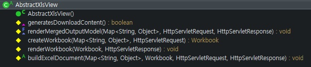

Apache POI의 SXSSF를 이용한 MS 엑셀 파일 생성 및 다운로드
========

## 1. Apache POI

- MS 오피스 파일 포맷을 자바 언어로 읽고 쓰는 기능을 제공하는 라이브러리
- MS 엑셀의 경우 HSSF, XSSF, SXSSF 컴포넌트를 용도에 맞추어 이용한다
    - HSSF: 엑셀 2007 이전 버전인 경우(xls)
    - XSSF: 엑셀 2007 이후 버전인 경우(xlsx)
    - SXSSF: XSSF의 Streaming Version. 대용량 엑셀 처리에 적합. **쓰기 전용**

### SXSSF

- 대용량 엑셀 처리 시 발생할 수 있는 Out of Memory에 대한 대책으로 주로 이용되는 컴포넌트
- 데이터를 메모리에 계속 가지고 있지 않고, 임시로 디스크에 생성한 파일(OOXML)에 기록한 뒤 메모리에서 삭제하는 방식
- XSSF는 전체 ROW에 대한 접근 및 제어가 가능하지만, SXSSF는 메모리에 보관 중인 ROW에 대해서만 접근 및 제어가 가능하다

#### ※ 각 컴포넌트 비교


## 2. 엑셀 파일 생성 및 저장

엑셀 파일 형식을 처음부터 모두 자바 코드로 생성하는 방법과 미리 생성해둔 엑셀 템플릿 파일을 읽은 뒤 추가적인 작업을 진행하는 경우로 나눌 수 있다. 엑셀 템플릿을 로딩하는 과정이 있냐 없냐의 차이이기 때문에 각 상황별로 적합한 방법을 선택하면 된다.

예제에서는 미리 생성해둔 엑셀 템플릿 파일을 활용하는 것으로 한다.


### 가. 템플릿 로딩 및 객체 생성

```java
String templateFilePath = "C:/test/test.xlsx";
int firstSheetIdx = 0;
int windowSize = 100;

InputStream templateFile = new FileInputStream(templateFilePath);
XSSFWorkbook templateWorkbook = new XSSFWorkbook(templateFile);

int rowIndex = templateWorkbook.getSheetAt(firstSheetIdx).getLastRowNum();

SXSSFWorkbook sxssfWorkbook = new SXSSFWorkbook(templateWorkbook, windowSize);

// 예제에서는 템플릿을 사용하기 때문에 시트를 새로 생성하지 않고 읽어들인다
Sheet sheet = sxssfWorkbook.getSheetAt(firstSheetIdx);
```
- SXSSF 형식은 쓰기 전용이기 때문에 엑셀 템플릿 파일을 XSSF Workbook으로 읽은 뒤, 매개변수로 전달하여 SXSSF Workbook 객체를 생성한다
  - 두번째 매개변수는 **window size**를 의미
  - 별도의 템플릿이 없는 경우 생성자를 변경
- 예제에서는 절대경로로 디스크에 존재하는 파일을 읽었지만, 실무 환경에서는 resource 경로에 별도의 엑셀 template 폴더를 두어 처리하는게 바람직


#### Window size
- 디스크로 flush 되기 전까지 메모리에 보관할 row의 개수를 의미 
- 기본값은 100(`SXSSFWorkbook.DEFAULT_WINDOW_SIZE`)
- window size 이상의 row가 들어올 경우, 메모리에 기록된 순서대로 디스크에 기록하고 메모리에서 삭제
  - 101번째 row에 도달 시 rownum=0인 row를 디스크에 flush 하고 메모리에서 삭제
  - 102번째 row에 도달 시 rownum=1인 row를 디스크에 flush 하고 메모리에서 삭제

### 나. 데이터 삽입

```java
for(int i = 0; i < 300; i++) {
  // Column 역할을 하는 행 이후부터 행 기록을 개시
  Row row = sheet.createRow(++rowIndex);

  // 해당 row에서 j번째 cell을 생성하여 값을 지정
  for(int j = 0; j < 3; j++) {
    Cell cell = row.createCell(j);
    cell.setCellValue("테스트 " + i);
  }
}

// 메모리에 존재하는, 남은 row들을 모두 디스크로 flush 한다
((SXSSFSheet)sheet).flushRows();
```
- 마지막 줄의 `flushRows()` 메소드로 디스크에 flush되지 않은, 메모리에 보관 중인 행을 수동으로 flush한다
- 예제에서는 for문을 이용하여 row를 반복 생성했지만, 실무에서는 DB의 데이터를 가져와서 작업하면 된다
  - 대량의 데이터인 경우 fetch size를 적절히 지정하여 사용하는 것이 좋다


#### ※ flush 관련 test

```java
// Column 역할을 하는 첫 번째 줄을 제외하고 test를 진행
for(int rownum = 1; rownum < 201; rownum++){
  Assert.assertNull(sheet.getRow(rownum));
}

// window size를 넘지 않아 자동으로 flush 되지 않고 메모리에 남아있는 row
for(int rownum = 201; rownum < 301; rownum++){
  Assert.assertNotNull(sheet.getRow(rownum));
}

// 메모리에 존재하는, 남은 row들을 모두 디스크로 flush 한다
((SXSSFSheet)sheet).flushRows();

// flush 한 이후에는 메모리에 해당 row가 존재하지 않는다
for(int rownum = 201; rownum < 301; rownum++){
  Assert.assertNull(sheet.getRow(rownum));
}
```

### 라. 파일 기록
```java
// 스트림을 이용하여 해당 경로에 파일 생성
FileOutputStream fos = new FileOutputStream("C:/test/testResult.xlsx");
sxssfWorkbook.write(fos);
fos.close();

// 임시 파일 삭제
sxssfWorkbook.dispose();
```
- SXSSF 사용 시 임시로 생성된 파일을 삭제하는 것이 중요


## 3. Spring 엑셀 파일 다운로드 기능 구현

- 별도의 Custom View를 구현하여 화면이 아닌 데이터를 전송한다
- 기존에는 `AbstractExcelView`가 있었으나, 4.2 버전 이후에는 Deprecated 되었음
- 용도에 따라 `AbstractXlsView`, `AbstractXlsxView`, `AbstractXlsxStreamingView`를 이용한다
  - AbstractView - AbstractXlsView - AbstractXlsxView - AbstractXlsxStreamingView 순으로 순방향 계층형 상속 구조를 가지고 있다
  - 일반적인 상황에서는 추상 메소드인 buildExcelDocument()를 구현하여 엑셀 작업을 하면 된다

※ 전자정부프레임워크에는 AbstractView를 구현한 AbstractPOIExcelView를 이용한다


### 가. AbstractXlsView 구조



- 다른 엑셀 뷰 추상 클래스의 부모 클래스에 해당
- Workbook 생성, 작업, 전송 설정, 전송에 관련된 메소드들이 정의되어 있다
- 자식 클래스에서는 사용되는 컴포넌트에 따라 적합하게 메소드를 Override 하여 구현되어 있다
- 이 중 엑셀 문서 작업을 하는 추상 클래스인 buildExcelDocument() 메소드의 구현이 필수적이다

### 나. 주요 메소드

#### 1) renderMergedOutputModel()
```java
@Override
protected final void renderMergedOutputModel(
    Map<String, Object> model, HttpServletRequest request, HttpServletResponse response) throws Exception {

  // Create a fresh workbook instance for this render step.
  Workbook workbook = createWorkbook(model, request);

  // Delegate to application-provided document code.
  buildExcelDocument(model, workbook, request, response);

  // Set the content type.
  response.setContentType(getContentType());

  // Flush byte array to servlet output stream.
  renderWorkbook(workbook, response);
}
```

- 위 순서대로 엑셀 파일을 생성하고, 문서 작업을 한 뒤, 엑셀 파일을 전송하게 된다

#### 2) createWorkbook()
```java
// AbstractXlsView
protected Workbook createWorkbook(Map<String, Object> model, HttpServletRequest request) {
  return new HSSFWorkbook();
}

// AbstractXlsxView
@Override
protected Workbook createWorkbook(Map<String, Object> model, HttpServletRequest request) {
  return new XSSFWorkbook();
}

// AbstractXlsxStreamingView
@Override
protected SXSSFWorkbook createWorkbook(Map<String, Object> model, HttpServletRequest request) {
  return new SXSSFWorkbook();
}
```
- 자식 클래스에서는 각 컴포넌트에 맞는 Workbook 인스턴스를 리턴하도록 구현되어 있다

#### 3) renderWorkbook()
```java
// AbstractXlsView
protected void renderWorkbook(Workbook workbook, HttpServletResponse response) throws IOException {
  ServletOutputStream out = response.getOutputStream();
  workbook.write(out);
  out.flush();

  // Closeable only implemented as of POI 3.10
  if (workbook instanceof Closeable) {
    ((Closeable) workbook).close();
  }
}

// AbstractXlsxStreamingView
@Override
protected void renderWorkbook(Workbook workbook, HttpServletResponse response) throws IOException {
  super.renderWorkbook(workbook, response);

  // Dispose of temporary files in case of streaming variant...
  ((SXSSFWorkbook) workbook).dispose();
}
```
- Servlet의 Stream을 이용하여 파일을 전송
- SXSSF는 임시 파일을 삭제하는 과정이 추가되어 있다

### 나. Controller 구현

#### 1) View Resolver를 이용하지 않는 경우

```java
@Log4j
@Controller
@RequestMapping("/download/excel/*")
public class ExcelController {
  
  @RequestMapping(value="/{templateFileName}/{fileName}", method=RequestMethod.GET)
  public View downloadExcel(@PathVariable String templateFileName, @PathVariable String fileName, Model model) {
    log.info("Download excel.........");
    
    model.addAttribute("templateFileName", templateFileName);
    model.addAttribute("fileName", fileName);
    
    return new CustomExcelView();
    
  }
  
}
```

#### 2) View Resolver를 이용하는 경우

##### BeanNameViewResolver 설정

```xml
<beans:bean id="beanNameViewResolver" class="org.springframework.web.servlet.view.BeanNameViewResolver" >
  <beans:property name="order" value="0" />
</beans:bean>

<beans:bean class="org.springframework.web.servlet.view.InternalResourceViewResolver">
  <beans:property name="order" value="1" />
  <beans:property name="prefix" value="/WEB-INF/views/" />
  <beans:property name="suffix" value=".jsp" />
</beans:bean>
```
- 예제에서는 전통적인 XML 설정을 이용했지만, Java 설정으로도 가능하다
- BeanNameViewResolver 설정 추가 필요
  - 뷰 이름과 동일한 이름의 빈 객체를 뷰 객체로 사용
  - 커스텀 View 클래스를 뷰로 사용해야 하는 경우 주로 사용
- order 프로퍼티를 설정하여 뷰 이름을 검사할 ViewResolver 순서를 정해야한다
  - 우선순위가 높은 ViewResolver에서 null이 리턴되면 그 다음 순위 ViewResolver로 넘어감

##### Controller

```java
@RequestMapping(value="/{templateFileName}/{fileName}", method=RequestMethod.GET)
public ModelAndView downloadExcel(@PathVariable String templateFileName, @PathVariable String fileName) {
  log.info("Download excel.........");
  
  ModelAndView mv = new ModelAndView("customExcelView");
  mv.addObject(templateFileName);
  mv.addObject(fileName);
  return mv;
}
```
- 뷰 이름을 지정하여 BeanNameViewResolver가 해당 View 객체를 이용할 수 있도록 한다
  - XML설정 혹은 annotation 설정으로 View 객체를 Bean에 등록시킬 필요가 있다

### 다. Custom View 구현

```java
@Component("customExcelView")
@Log4j
public class CustomExcelView extends AbstractXlsxStreamingView {
  
  private final int FIRST_SHEET_INDEX = 0;
  private final String TEMPLATE_PATH = "/template/excel/";
  private final String XSSF_EXT = ".xlsx";
  
  @Override
  protected SXSSFWorkbook createWorkbook(Map<String, Object> model, HttpServletRequest request) {
    
    String templateFileName = TEMPLATE_PATH + String.valueOf(model.get("templateFileName")) + XSSF_EXT;
    
    XSSFWorkbook templateWorkbook = null;
    
    // resource 경로에 있는 엑셀 템플릿 파일을 읽는다
    try(InputStream templateFile = getClass().getResourceAsStream(templateFileName)) {
      templateWorkbook = new XSSFWorkbook(templateFile);
    } catch (Exception e) {
      log.error("excel template file not found");
      e.printStackTrace();
    }
    
    int rowIndex = templateWorkbook.getSheetAt(FIRST_SHEET_INDEX).getLastRowNum();
    model.put("rowIndex", rowIndex);
    
    return new SXSSFWorkbook(templateWorkbook, SXSSFWorkbook.DEFAULT_WINDOW_SIZE);
  }

  @Override
  protected void buildExcelDocument(Map<String, Object> model, Workbook workbook, HttpServletRequest request,
      HttpServletResponse response) throws Exception {

      // 파일 이름 설정
      String fileName = URLEncoder.encode(String.valueOf(model.get("fileName")), "UTF-8");
      response.setHeader("Content-Disposition", "attachment; filename=\"" + fileName + XSSF_EXT +  "\" ; charset=\"UTF-8\"");
      
      // 예제에서는 템플릿을 사용하기 때문에 시트를 새로 생성하지 않고 읽어들인다
      Sheet sheet = workbook.getSheetAt(FIRST_SHEET_INDEX);
      
      int rowIndex = (int) model.get("rowIndex");
      injectData(rowIndex, sheet);
  
      // 메모리에 존재하는 모든 row를 디스크에 기록
      ((SXSSFSheet)sheet).flushRows();
  }

  private void injectData(int rowIndex, Sheet sheet) {
    for(int i = 0; i < 300; i++) {
      // Column 역할을 하는 행 이후부터 행 기록을 개시
      Row row = sheet.createRow(++rowIndex);
 
      // 해당 row에서 j번째 cell을 생성하여 값을 지정
      for(int j = 0; j < 3; j++) {
        Cell cell = row.createCell(j);
        cell.setCellValue("테스트" + i);
      }
    }
  }

}
```
- 예제대로 템플릿을 불러와서 작업한다면, createWorkbook() 메소드를 Override 해서 기본 생성자 대신 템플릿 설정이 된 인스턴스를 리턴해야 한다
- 템플릿을 사용하지 않는다면 buildExcelDocument() 메소드만을 구현하여도 무방하다


#### 3) View를 이용하지 않고 직접 전송
```java
@Log4j
@Controller
@RequestMapping("/download/excel/*")
public class ExcelController {
  
  @Autowired
  private ExcelService service;
  
  @RequestMapping(value="/{templateFileName}/{fileName}", method=RequestMethod.GET)
  public void downloadExcel(@PathVariable String templateFileName, @PathVariable String fileName, HttpServletResponse res) {
    SXSSFWorkbook result = service.makeExcelFile(templateFileName);

    res.setContentType("application/vnd.ms-excel");
    res.setHeader("Content-Disposition", String.format("attachment; filename=\"%s.xlsx\"", URLEncoder.encode(fileName, "UTF-8")));
    result.write(res.getOutputStream());
    // res.getOutputStream().close();
    result.dispose();

}
```
- 별도의 뷰 설정 없이 비즈니스 로직에서 생성한 엑셀 파일을 스트림으로 바로 전송하여도 파일 전송은 가능하다
- 스트림을 직접 연 것이 아니기 때문에 서블릿 컨테이너에게 생명주기를 맡기는 것이 바람직하다

--------

> 참고 사이트 및 도서
> <br/>1. [Apache-POI Quick Guide](http://poi.apache.org/components/spreadsheet/quick-guide.html)
> <br/>2. [티몬 기술 블로그](http://tmondev.blog.me/221388780914)
> <br/>3. [OffByOne님 블로그](https://offbyone.tistory.com/70)
> <br/>4. 토비의 스프링 3.1 Vol.2 - 뷰 리졸버(p.435~)