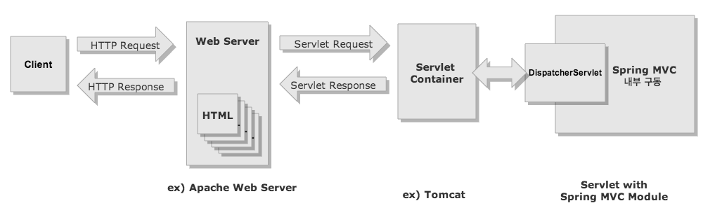
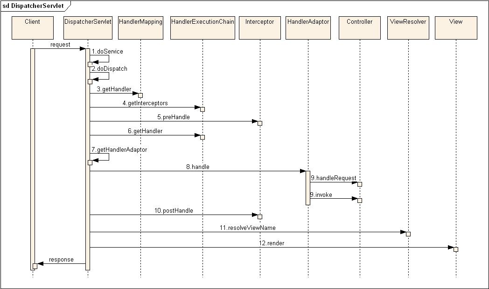

Spring
========

- Spring은 일종의 Container 역할을 하는 프레임워크로서 여러 모듈로 구성되어 있음
- Spring 프레임워크는 웹 프레임워크가 아님
- 웹 개발을 위해 Spring MVC 모듈을 이용

## 1. Spring MVC 모듈



- MVC 패턴을 적용해 웹 애플리케이션을 만들 수 있는 Spring 모듈 중 하나
- 내부적으로 Servlet API를 활용한다.
- Spring MVC 모듈 내부에 `Servlet(DispatcherServlet)`을 포함하고 있다.
- Spring MVC로의 모든 요청과 응답은 `DispatcherServlet`이 관리하게 된다.
- Spring MVC를 통해 만들어진 프로그램은 DispatcherServlet을 Servlet Container에 등록하여 동작하도록 한다.

## 2. Servlet과 Servlet Container

### 가. Servlet

- Java 진영의 동적 웹 서비스를 위한 인터페이스.
- 원칙적으로는 `javax.servlet.Servlet` 인터페이스의 구현체.
- 일반적인 자바 독립 실행 프로그램과 달리 main 메서드가 없으며, Servlet Container에 등록된 후 Servlet Container에 의해 생성, 호출, 소멸이 이루어진다.

### 나. Servlet Container
- Java로 웹을 개발하기 위해 필요한 Servlet들의 일종의 저장소
- Servlet을 실행하고 관리하며 네트워크 통신, Servlet의 생명주기 관리, 스레드 기반의 병렬처리를 대행한다.

#### ※ Servlet Container의 주요 기능
- 생명 주기 관리 : Servlet을 로드해 초기화(init) 한다. 또 클라이언트의 요청으로 Servlet 메소드를 호출하며, Servlet Container가 종료되면 Servlet을 종료시키고(destroy) 메모리를 정리한다.
- 통신 지원 : 웹 서버로부터 받은 요청을 분석해 Servlet을 실행시키고, Servlet에서는 웹 서버의 정보를 확인할 수 있도록 하는 기능을 제공한다.
- 멀티스레딩 지원 : 클라이언트의 요청에 따라 Servlet을 생성하고, 이미 생성된 Servlet에 대한 요청은 스레드를 생성해 실행한다.

## 2. Spring MVC 프로젝트 로딩 구조

- Spring MVC 프로젝트 구동 시 관여하는 파일은 `web.xml`, `root-context.xml`, `servlet-context.xml`
- `web.xml`은 Tomcat 구동과 관련된 설정
- `root-context.xml`과 `servlet-context.xml`이 Spring과 관련된 설정

### 가. ContextLoaderListener
```xml
<context-param>
    <param-name>contextConfigLocation</param-name>
    <param-value>
        /WEB-INF/spring/root-context.xml
    </param-value>
</context-param>
<listener>
    <listener-class>org.springframework.web.context.ContextLoaderListener</listener-class>
</listener>
```

1. 웹 애플리케이션이 실행되면 Tomcat에 의해 `web.xml`이 로딩된다.
2. web.xml에 등록되어 있는 `ContextLoaderListener` 클래스가 생성된다. ContextLoaderListener 클래스는 `ServletContextListener` 인터페이스를 구현하고 있으며, **Spring Container**라 할 수 있는 `WebApplicationContext(이하 WAC)`를 생성하는 역할을 수행한다.
3. 생성된 ContextLoaderListener는 `root-context.xml`을 로딩하여 해당 파일에 정의된 Bean 객체를 WAC에 생성한다.

> ContextLoaderListener에 의해 생성되는 WAC는 **Root WAC** 이라고 한다. **전역에서 사용 가능**

#### ※ Spring Container 종류

##### 1. BeanFactory
- Spring 설정 파일에 등록된 Bean 객체를 생성하고 관리하는 가장 기본적인 Container 기능만 제공
- Container 구동 시 Bean 객체를 생성하지 않고, 클라이언트의 요청에 의해서만 객체를 생성함(lazy loading)

##### 2. ApplicationContext
- Container가 구동되는 시점에 Bean 객체를 생성함(eager loading)
- 일반적으로 ApplicationContext가 사용됨

### 나. DispatcherServlet

```xml
<servlet>
    <servlet-name>appServlet</servlet-name>
    <servlet-class>org.springframework.web.servlet.DispatcherServlet</servlet-class>
    <init-param>
        <param-name>contextConfigLocation</param-name>
        <param-value>/WEB-INF/spring/appServlet/servlet-context.xml</param-value>
    </init-param>
    <load-on-startup>1</load-on-startup>
</servlet>

<servlet-mapping>
    <servlet-name>appServlet</servlet-name>
    <url-pattern>/</url-pattern>
</servlet-mapping>
```

1. root-context.xml 로딩 이후 `DispatcherServlet` 관련 설정 로딩이 시작된다.
    - `<load-on-startup>`: Servlet 로딩 시 init() 메소드 실행 우선권을 설정
2. Servlet의 Request를 DispatcherServlet이 처리하도록 매핑시킨다.
    - `<url-pattern>/</url-pattern>`
    - **하나의 DispatcherServlet에 모든 경로를 매핑시켜 처리하는 것이 일반적**이나, 여러 DispatcherServlet을 각각 다른 경로로 매핑시켜도 가능하긴 하다.
3. `XmlWebApplicationContext`를 이용해서 `servlet-context.xml`을 로딩하여 해당 파일에 정의된 Bean 객체를 WAC에 생성한다

> 이 때 생성되는 WAC를 **Servlet WAC**이라고 한다. **해당 Servlet에서만** 사용 가능

 
#### ※ WAC 계층


- 일반적인 Spring 웹 프로젝트에서 Context는 2개가 만들어진다
- **Root WAC**에는 전체에 적용 가능한 프로퍼티, DB, 로깅 등의 **서비스 객체**를 등록한다
- **Servlet WAC**에는 해당 Servlet에서만 사용될 **View와 관련된 객체**를 등록한다
- Servlet WAC는 Root WAC이 제공하는 Bean을 사용할 수 있지만 반대는 불가능
- [WAC을 하나만 쓰는 경우](http://toby.epril.com/?p=934)


## 5. Spring MVC 모듈 동작 프로세스



1. `DispatcherServlet`이 Client로부터 요청을 받는다.
2. `HandlerMapping`을 통해서 요청을 처리할 Controller를 찾는다.
3. 해당 `Controller`로 요청을 보낸다.
4. Controller로부터 `ModelAndView`를 반환 받는다.
5. 반환받은 ViewName으로 `ViewResolver`를 통해 View를 찾는다.
6. 찾은 View 파일에 Controller가 만들었던 Model을 이용하여 View를 완성하게 한다.
7. 완성된 View가 `Response`가 되어 Client로 전해진다.
