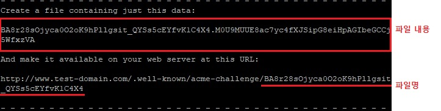
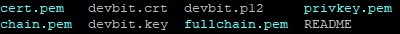
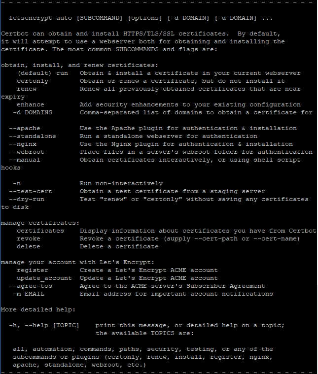

리눅스 환경에서 Certbot을 활용하여 Let's Encrypt SSL 인증서 발급받기
========

리눅스 환경에서 Certbot을 활용하여 Let's Encrypt의 SSL 인증서를 발급받는 방법

실습 환경에서 인증을 받기 위한 웹 서버로는 nginx를 이용하며, 인증 방식은 수동(Manual)으로 진행한다

## 1. 준비 작업

git과 nginx 설치 필요

### 가. Ubuntu

```bash
apt-get install git
apt-get install nginx
```

### 나. CentOS

- CentOS의 경우 nginx 저장소 추가 작업이 필요
- [nginx 공식 사이트 참고](https://www.nginx.com/resources/wiki/start/topics/tutorials/install/)

#### 1) 저장소 파일 생성
```bash
vi /etc/yum.repos.d/nginx.repo

[nginx]
name=nginx repo
baseurl=http://nginx.org/packages/centos/$releasever/$basearch/
gpgcheck=0
enabled=1
```

#### 2) 설치
```bash
yum install git
yum install nginx
```

## 2. Certbot 설치

```bash
cd
git clone https://github.com/letsencrypt/letsencrypt
cd letsencrypt
```
- git 클론 경로는 자신이 이용하기 편한 장소로 설정하여도 무방함

## 3. 도메인 소유자 인증 방식

크게 Standalone 방식과 Webroot 방식이 존재

### 가. Standalone

- Certbot이 자체적으로 간이 웹 서버를 구동하여 도메인 인증 요청을 직접 처리
- 인증용 간이 웹서버가 80 혹은 443 포트를 이용해서 동작하기 때문에 구동 중인 웹 서버를 Shutdown 해야 함
- 구동 중인 웹 서버가 80, 443 이외의 포트를 이용 중이라면 문제 없음

### 나. Webroot

- 인증을 위한 Challenge Seed를 외부에서 접근 가능한 미리 약속된 경로(Webroot)에 위치시킨 뒤, Let's Encrypt 서버가 해당 경로로 접속해 인증에 필요한 정보를 읽어가는 방식
- 서버의 파일시스템 내에 웹에서 접근 가능한 디렉토리를 생성하고
- 외부에서 HTTP(S)로 접근 가능하도록 웹 서버를 설정해야 한다
- 예제에서는 Webroot 방식을 이용

### 다. 플러그인 활용
- 각 서버에 맞는 플러그인 이용 시 인증서 발급부터 서버 설정까지 자동으로 진행
- 예제에서는 플러그인을 이용하지 않고 수동으로 진행한다


## 4. 인증서 발급

### 가. Certbot 실행(Manual)

```bash
./letsencrypt-auto certonly --manual -m [이메일] -d [도메인]
```
- 이메일, 도메인 등의 파라미터를 미리 입력하면 추후 진행단계에서 생략된다
- 입력 후 약관 동의 여부, IP 로깅 활성화 등의 질문에 답변
- 이후 파일 생성 메시지가 나오면 대기

### 나. Webroot 인증 파일 생성



- 도메인 유효성 확인 절차
- Webroot 인증을 위해 지정된 경로에 해당 내용을 담은 파일을 생성해야 한다

```bash
mkdir -p /var/www/html/.well-known/acme-challenge
vi /var/www/html/.well-known/acme-challenge/[파일명]
[파일 내용]
```

- nginx의 기본 파일 경로는 다음과 같으며, 설정에서 location을 임의로 변경하여 진행하여도 무방하다
- 해당 파일을 생성하고 엔터를 입력하여 인증을 계속 진행


### 다. 인증 결과

#### 실패 시 
```bash
IMPORTANT NOTES:
- The following 'urn:acme:error:unauthorized' errors were reported by
  the server:
  Domains: [도메인]
  Error: The client lacks sufficient authorization
```

#### 성공 시

```bash
IMPORTANT NOTES:
 - Congratulations! Your certificate and chain have been saved at
   /etc/letsencrypt/live/[도메인]/fullchain.pem. Your cert
   will expire on [인증서 만료일]. To obtain a new version of the
   certificate in the future, simply run Let's Encrypt again.
 - If like Let's Encrypt, please consider supporting our work by:

   Donating to ISRG / Let's Encrypt:   https://letsencrypt.org/donate
   Donating to EFF:                    https://eff.org/donate-le
```

#### 인증서 경로



- `/etc/letsencrypt/live/[도메인]/` 경로에 생성된 인증서 파일들(pem)의 심볼릭 링크 파일이 있다
- 실제 인증서 파일의 저장 경로는 `/etc/letsencrypt/archive/[도메인]`
- 실 사용시에는 주로 심볼릭 링크를 이용한다

---

### ※ Certbot 명령어



- `-h`, `--help` 명령어로 certbot 옵션 확인 가능